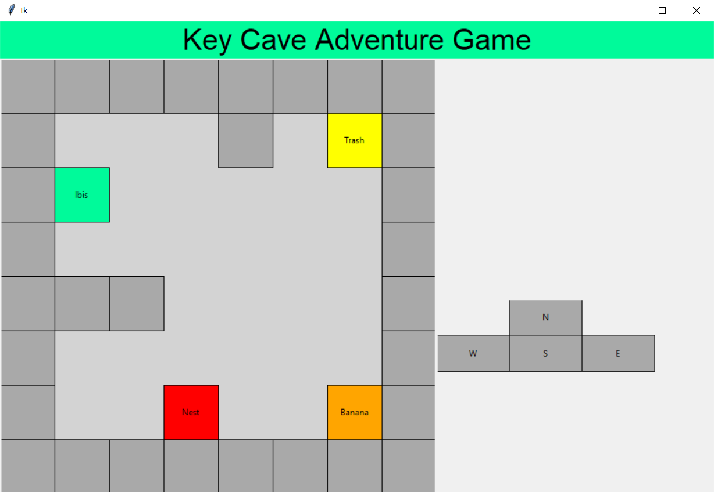
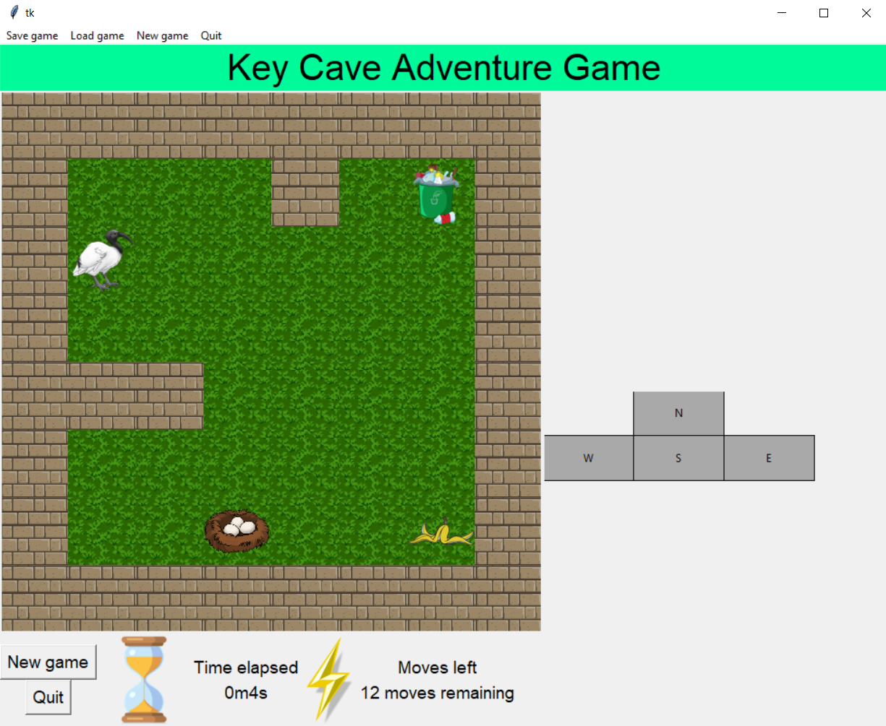

# Key-Cave-Adventure-Game-with-GUI
## Background
The new version of this game is a single-player GUI-based game in which the player is presented with a grid of
squares (represented by either coloured rectangles or images). The objective is for the ibis (the player) to collect
the trash and take it to their nest. The player can move either by key presses or by clicking on an on-screen keypad.
## Usage
You need to import the following libraries: tkinter and PIL.  
Run a3.py to start the game.
a2_support.py and gamen.txt are required for a3.py.  
There are two modes to show the game: coloured rectangles mode and images mode. You can change "TASK_ONE" (coloured rectangles mode) or "TASK_TWO" (images) in the main() function in a3.py.
## Appendix
- Game example for TASK_ONE mode

- Game example for TASK_TWO mode

